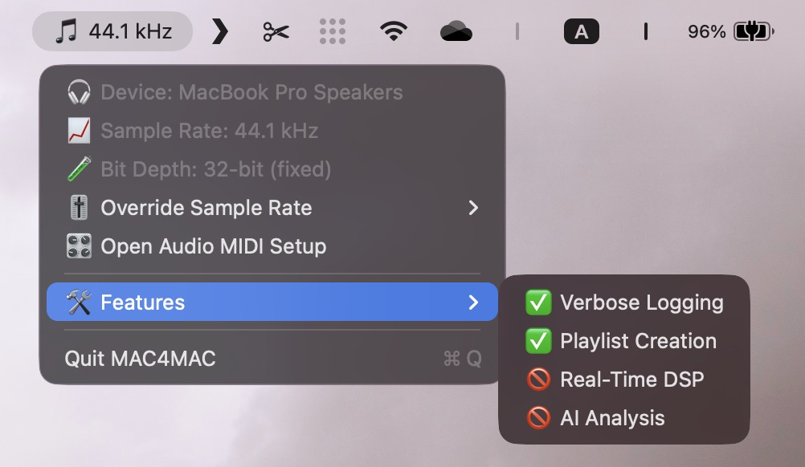
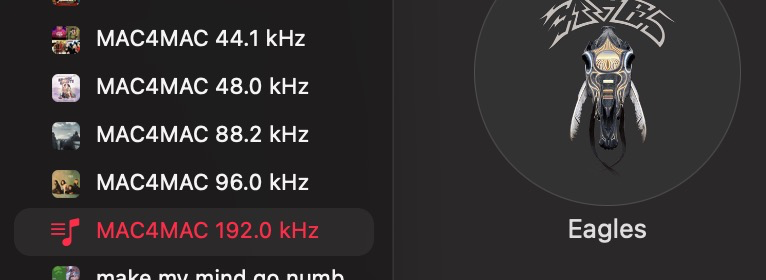
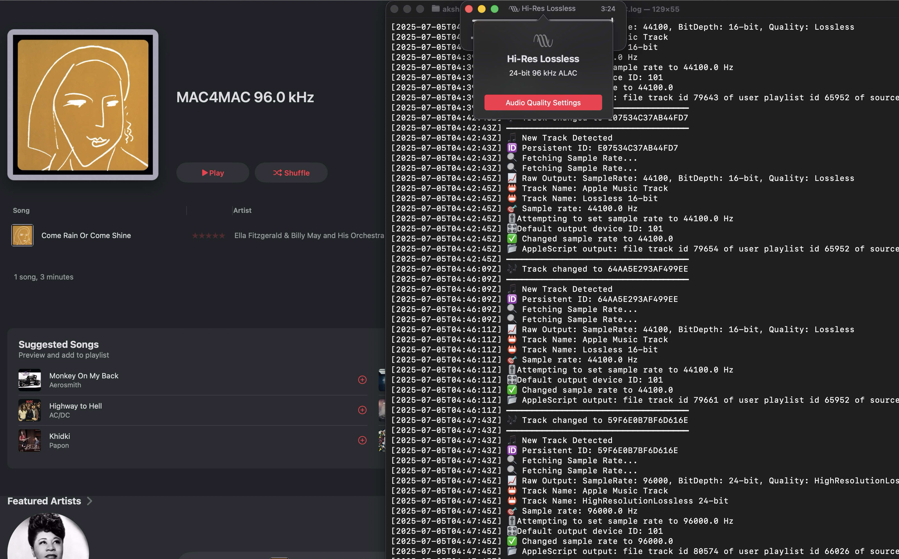

# 🎧 MAC4MAC – Master Audio Controller for Mac - Bring Bit-perfect audio to mac

**MAC4MAC** is a lightweight, native macOS menu bar app that automatically adjusts your system's audio output sample rate to match the current Apple Music track — giving you bit-perfect playback every time.

---

## 📥 Download

👉 [**Download latest version**](https://github.com/sifaralways/Mac4Mac/releases/latest) from the Releases page.  
No need to build or clone — just download the `.app`, move it to Applications, and run.

> **Requires macOS Monterey or later**  
> On first launch, grant **Automation** access for the Music app.

---

## ✨ Features

- 🔍 **Detects Apple Music track sample rate** from system logs
- 🎚️ **Auto-switches** your system audio output to match
- 📟 Displays **current sample rate & device** in menu bar
- 📝 **Optional playlist creation** by sample rate
  - e.g., `MAC4MAC 96 kHz`, `MAC4MAC 192 kHz`
- ✏️ **Customizable playlist prefix**
- 🔧 Toggle playlist feature from menu bar
- 📂 Logs all activity in `~/Library/Logs/MAC4MAC.log`
- 🧠 **Intelligent log parsing** fallback if sample rate logs are missing
- 🎛️ Manual override for sample rate
- 💡 Minimal native UI, auto-launch ready

---

## 🖼️ Preview

> _Screenshots coming soon!_





---

## 📂 Example Log Output

MAC4MAC keeps detailed logs under:

~/Library/Logs/MAC4MAC.log

Sample log for a track:

```text
[2025-07-05T03:16:57Z] ━━━━━━━━━━━━━━━━━━━━━━━━━━━━━━━━━━━━
[2025-07-05T03:16:57Z] 🎵 New Track Detected
[2025-07-05T03:16:57Z] 🆔 Persistent ID: F6DB04D20640D93F
[2025-07-05T03:16:57Z] 🔍 Fetching Sample Rate...
[2025-07-05T03:16:57Z] 📛 Track Name: Apple Music Track
[2025-07-05T03:16:57Z] 🎯 Sample rate: 96000.0 Hz
[2025-07-05T03:16:57Z] ✅ Changed sample rate to 96000.0
[2025-07-05T03:16:57Z] ➕ Added track to playlist 'MAC4MAC 96 kHz'
[2025-07-05T03:16:57Z] ━━━━━━━━━━━━━━━━━━━━━━━━━━━━━━━━━━━━


⸻

🎛️ Menu Bar Options

Menu Item	Description
🎧 Device: [Name]	Current audio output device
📈 Sample Rate: [X] kHz	Current system output sample rate
🧪 Bit Depth: 32-bit (fixed)	Shown for reference
🎚️ Override Sample Rate	Choose a new rate manually
📝 Enable Playlist Creation	Toggle to allow/disallow playlist updates
✏️ Set Playlist Prefix	Set prefix used when creating playlists (optional)
🎛️ Open Audio MIDI Setup	Opens native macOS audio tool
❌ Quit MAC4MAC	Closes the app


⸻

🔒 Permissions & Setup

The app needs Automation access to control Apple Music.
	1.	First time launch → You’ll be prompted
	2.	If not:
	•	Go to System Settings → Privacy & Security → Automation
	•	Enable MAC4MAC → Music

For full functionality, the app must:
	•	Have Automation permissions
	•	Be in /Applications or a non-quarantined folder

⸻

⚙️ Settings

Settings are persisted between launches.
You can access them via the menu bar:
	•	✅ Enable/disable playlist management
	•	✏️ Change playlist name prefix

Playlists are only created if:
	•	Playlist feature is enabled
	•	Track has a valid persistentID
	•	Track is found in the Apple Music library

⸻

🚧 Known Limitations
	•	Only supports Apple Music
	•	Only works for local tracks in your library
	•	Playlist creation may fail for:
	•	Streaming-only tracks (no persistent ID)
	•	Missing permissions
	•	Sample rate detection depends on system logs (which Apple may change)

⸻

🔧 Developer Notes

Folder Structure

MAC4MAC/
├── AppDelegate.swift         # Main app lifecycle
├── Audio/AudioManager.swift  # Audio device interface
├── Monitors/
│   ├── TrackChangeMonitor.swift
│   └── LogMonitor.swift
├── Playlists/PlaylistManager.swift
├── Settings/SettingsManager.swift
├── Utils/LogWriter.swift

Built With
	•	Swift
	•	AppleScript (via ScriptingBridge)
	•	CoreAudio
	•	log show and shell piping
	•	No external dependencies

⸻

🤝 Credits
	•	Created by Akshat Singhal
	•	Based on feedback from the Apple Music audiophile community
	•	Inspired by tools like BitPerfect and SampleRateMenu

⸻

📃 License

MIT License — free to use, adapt, and improve.

⸻

🔗 Related
	•	Apple Music Lossless FAQ
	•	CoreAudio Overview

