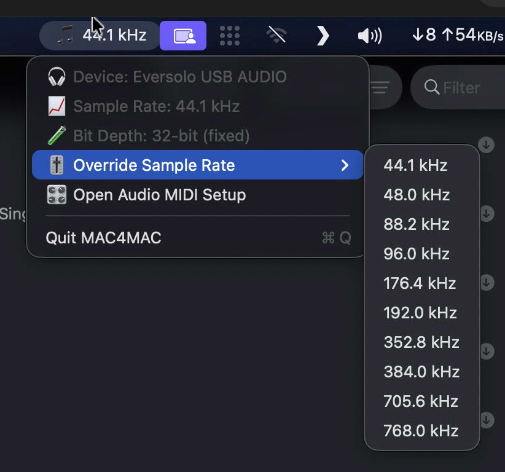

# 🎧 MAC4MAC – Master Audio Controller for Mac

**MAC4MAC** is a lightweight macOS menu bar utility designed for audiophiles.  
It automatically switches your system's **audio output sample rate** to match the currently playing **Apple Music** track — giving you optimal fidelity without lifting a finger.

---

## 📥 Download

👉 [Download latest version](https://github.com/sifaralways/Mac4Mac/releases/latest) from the [**Releases**](https://github.com/sifaralways/Mac4Mac/releases) page.  
No need to build or clone — just download, run, and enjoy.

> **Requires macOS Monterey or later**  
> On first launch, grant **Automation** access for Apple Music when prompted.

---

## ✨ Features

- 🎵 Automatically detects Apple Music track sample rate from macOS logs
- 🎚️ Instantly switches your system's output sample rate
- 🎧 Displays current output device, sample rate & bit depth in menu bar
- 📁 Logs track + sample rate in `~/Library/Logs/MAC4MAC.log`
- 🧠 Creates and maintains **Apple Music playlists** by sample rate:
  - e.g., `MAC4MAC 44.1 kHz`, `MAC4MAC 192 kHz`, etc.
- 🖱️ Manual override for supported sample rates via menu
- ☑️ Minimal, native macOS menu bar experience

---

## 📸 Preview

---

## 🧪 How It Works

1. Listens for **track changes** in Apple Music.
2. Reads sample rate from the system log:

Created new AudioQueue for format: sampleRate:44100.000000

3. Changes output sample rate using CoreAudio APIs.
4. Logs the event and adds the track to a sample rate-based playlist (if available).

---

## 📂 Example Log Output

Logs are saved at:  
`~/Library/Logs/MAC4MAC.log`

Example:

[2025-07-04T21:00:18Z] 🎶 Track changed to 8197F7C7D276B7C6

[2025-07-04T21:00:20Z] 🧠 Matched sampleRate: 96000.0, song: Apple Music Track

[2025-07-04T21:00:20Z] 🎯 Sample rate: 96000.0 Hz, Song: Apple Music Track

[2025-07-04T21:00:20Z] ✅ Changed sample rate to 96000.0

[2025-07-04T21:00:20Z] ➕ Added track to playlist ‘MAC4MAC 96 kHz’

---

## 🎛️ Menu Bar Options

| Label                          | Description                            |
|--------------------------------|----------------------------------------|
| 🎧 Output: [Device]            | Displays current audio output device   |
| 📈 Sample Rate: [Rate]         | Shows current sample rate              |
| 🧪 Bit Depth: 32-bit (fixed)   | Always 32-bit                          |
| 🎚️ Override Sample Rate       | Manually choose from supported rates   |
| 🎛️ Open Audio MIDI Setup      | Opens native macOS utility             |
| ❌ Quit MAC4MAC                | Exits the app                          |

---

## 🔒 Permissions

To function correctly, the app needs:

- **Automation Access** for the **Music** app (you’ll be prompted on first run)
- App Sandbox must be **disabled** (already done for releases)

If Automation is not working:
1. Open **System Settings > Privacy & Security > Automation**
2. Enable toggle for **MAC4MAC → Music**

---

## 🚧 Known Limitations

- Only supports **Apple Music** (not Spotify or other players)
- Song must exist in your **local library** for playlist management
- Some virtual devices (e.g., AirPlay, HDMI) may block sample rate switching

---

## 🛠️ Developer Notes

If you want to build or extend this project:

### 🧾 Requirements

- macOS Monterey or newer
- Xcode 14+
- App Sandbox must be **disabled**
- Automation permission for `com.apple.Music`

---

## 🤝 Credits

- Concept & development: [Akshat Singhal](https://github.com/sifaralways)
- Powered by: CoreAudio, AppleScript, and Swift
- Core Foundation: [vincentneo](https://github.com/vincentneo)

---

## 📃 License

MIT License — feel free to use, fork, improve, and share.

⸻
